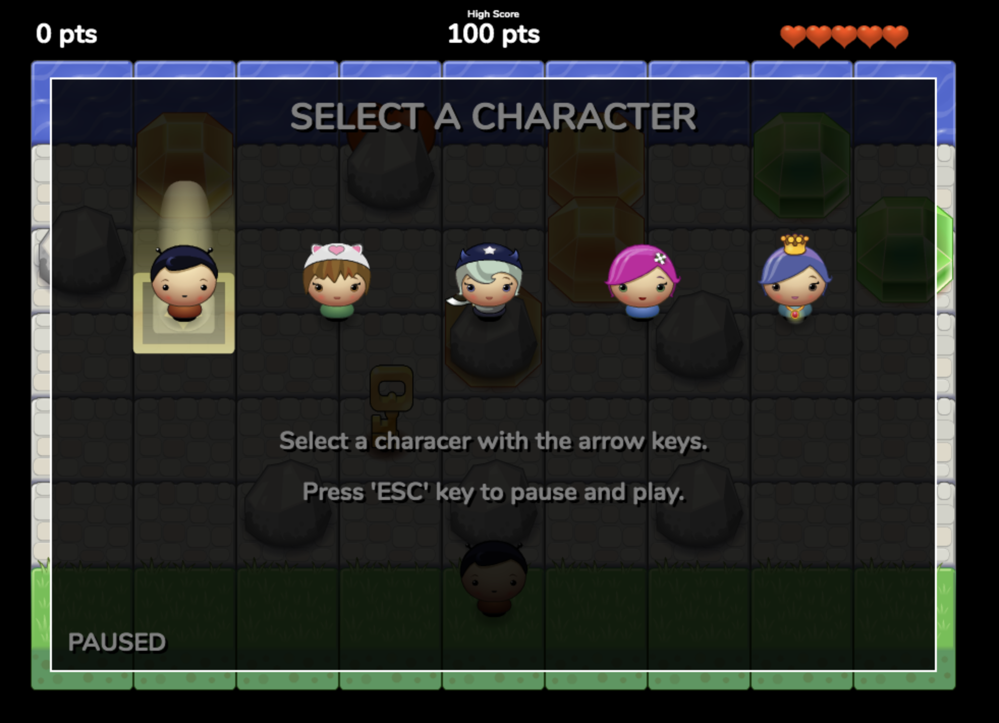

HTML5 Canvas Frogger Game
======================
**[View My Completed Game](https://coltonehrman.github.io/udacity-canvas-game)**

Created this game as part of the Front End Web Developer - [NanoDegree](https://www.udacity.com/course/front-end-web-developer-nanodegree--nd0011) offered by [Udacity]([https://www.udacity.com/). Learned how to interact with the HTML5 Canvas element in an Object-Oriented manner.

## How to Play?

**Pause Screen**
- *Movement* - Select your character using the arrow keys.
- *Start* - When your desired character is highlighted you can press 'ESC' to start playing

**Play Screen**
- *Movement* - You move your character around the board with the arrow keys (you cannot move vertically)
- *Objective* - Grab the key and reach the end while gaining the most points

*Bugs* - Bugs will continuously move across the screen at various speeds to squash you. If you get squashed you will ***lose a life*** and ***drop the key*** if you were holding it.

*Rocks* - You cannot move over a rock, but you can run into them to obtain items inside the rock. ***(If a bug is crossing the rock at the same time you run into it, you will be squashed)***

*Gems* - Each gem will give you points.

*Key* - Obtain the key to reach the end. ***(Without the key you will be stuck at the end)***
